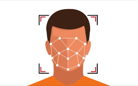

# Face and Smile Detection using Artificial Intelligence

Welcome to the "Face and Smile Detection using Artificial Intelligence" project! This Python project is designed to detect faces and smiles of a person, including their eyes, utilizing the power of artificial intelligence.

## Table of Contents
- [Introduction](#introduction)
- [Files](#files)
- [Getting Started](#getting-started)
- [License](#license)

## Introduction

The main objective of this project is to employ artificial intelligence techniques to detect faces and smiles in images. By leveraging OpenCV and Haar cascades, the project can accurately locate and highlight facial features, including eyes, nose, and mouth. This application can be used in various scenarios, such as photo editing, security systems, and interactive applications.

## Files

The repository contains the following files:

- [emotion_detector.py](emotion_detector.py) - Python script for face and smile detection using Haar cascades and OpenCV.
- [eye.xml](eye.xml) - XML file containing the trained Haar cascade for eye detection.
- [face.xml](face.xml) - XML file containing the trained Haar cascade for face detection.
- [smile.xml](smile.xml) - XML file containing the trained Haar cascade for smile detection.
- [test.jpg](test.jpg) - Sample image used for testing the face and smile detection algorithm.

## Getting Started

To get started with the face and smile detection project, follow these steps:

1. Clone the repository locally using `git clone [repository_url]`.
2. Make sure you have Python and OpenCV installed on your system.
3. Run the `emotion_detector.py` script to perform face and smile detection on the provided image or your custom images.
4. Experiment with different images and parameters to optimize the detection accuracy.

## License

This project is licensed under the [MIT License](LICENSE), which permits you to use, modify, and distribute the code under the terms specified in the license.

Feel free to explore the repository and try out the face and smile detection capabilities of this project!

Please note: The accuracy and performance of the detection may vary based on the quality of input images and the parameters used. For optimal results, consider training the cascades on a larger dataset specific to your application.
